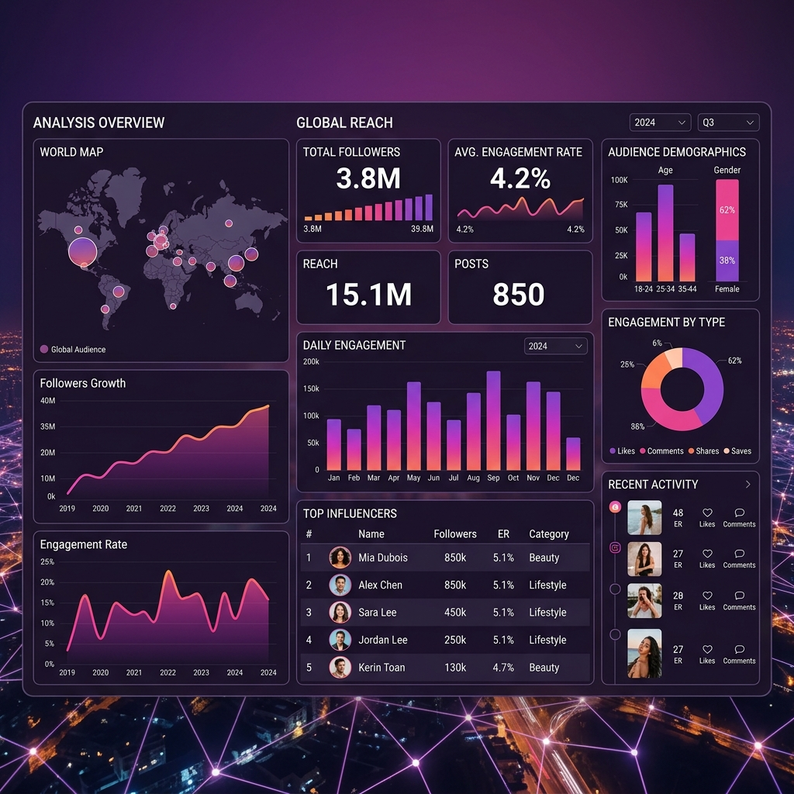

# 📸 Project 01: Instagram Influencer Impact Analysis

> **"팔로워 수만 보면 안 된다! 인플루언서 영향력을 측정하는 다양한 기준"**
>
> *Beyond follower counts: A data-driven approach to measuring true social media influence.*

#

## 📌 Project Overview
본 프로젝트는 글로벌 톱 200 인스타그램 인플루언서 데이터를 분석하여, 단순한 팔로워 규모를 넘어 **'진정한 영향력(Impact)'**을 정의하는 지표들을 탐색합니다. 데이터 전처리부터 탐색적 데이터 분석(EDA), 그리고 최종 시각화 대시보드 구축까지의 전 과정을 포함합니다.

## 🚀 Key Strengths & Achievements
- **Robust Data Cleaning**: 결측치 처리 및 단위 변환(m, k, b 등)을 통한 정교한 데이터셋 구축.
- **Multidimensional Analysis**: Follower Count, Engagement Rate, Influence Score 간의 상관관계를 심층 분석.
- **Actionable Insights**: 국가별/분야별 인플루언서 특징을 도출하여 브랜드 마케팅 전략 수립의 근거 마련.
- **Premium Visualization**: Tableau를 활용한 인터랙티브 대시보드로 복잡한 데이터 인사이트를 한눈에 전달.

## 📂 Project Structure
```text
project_01_instagram_influencer_analysis/
├── README.md                           # Project documentation
├── notebooks/
│   ├── instagram_influencer_preprocessing_eda.ipynb  # Data cleaning & EDA
│   └── instagram_influencer_premium_analysis.ipynb   # Premium data storytelling [NEW]
├── data/
│   └── processed/
│       └── insta_influencers_tableau_ready.csv     # Cleaned data for BI tools
├── dashboard/
│   ├── tableau_public_link.md          # Link to interactive dashboard
│   └── tableau_design_guide.md         # Professional design guide [NEW]
└── assets/
    └── dashboard_thumbnail.png         # Project cover image
```

## 📊 Data Insights (Quick Preview)
- **Top Metrics**:
  - `Influence Score`: 자체 산출된 영향력 지수
  - `Engagement Rate`: 팔로워 대비 소통 효율 (최근 60일 기준)
  - `Post Frequency`: 콘텐츠 업로드 빈도와 영향력의 상관관계
- **Global Reach**: 25개국 이상의 글로벌 데이터를 기반으로 한 국가별 영향력 분포 확인.

## 🛠 Tech Stack
- **Languages**: Python (Pandas, NumPy)
- **Environment**: Jupyter Notebook (Google Colab)
- **Visualization**: Tableau Public, Matplotlib/Seaborn
- **Documentation**: Markdown

## 🔗 Dashboard Link
[**Tableau Public 대시보드 바로가기**](./dashboard/tableau_public_link.md)

---
*Created by [Your Name / GitHub ID]*
